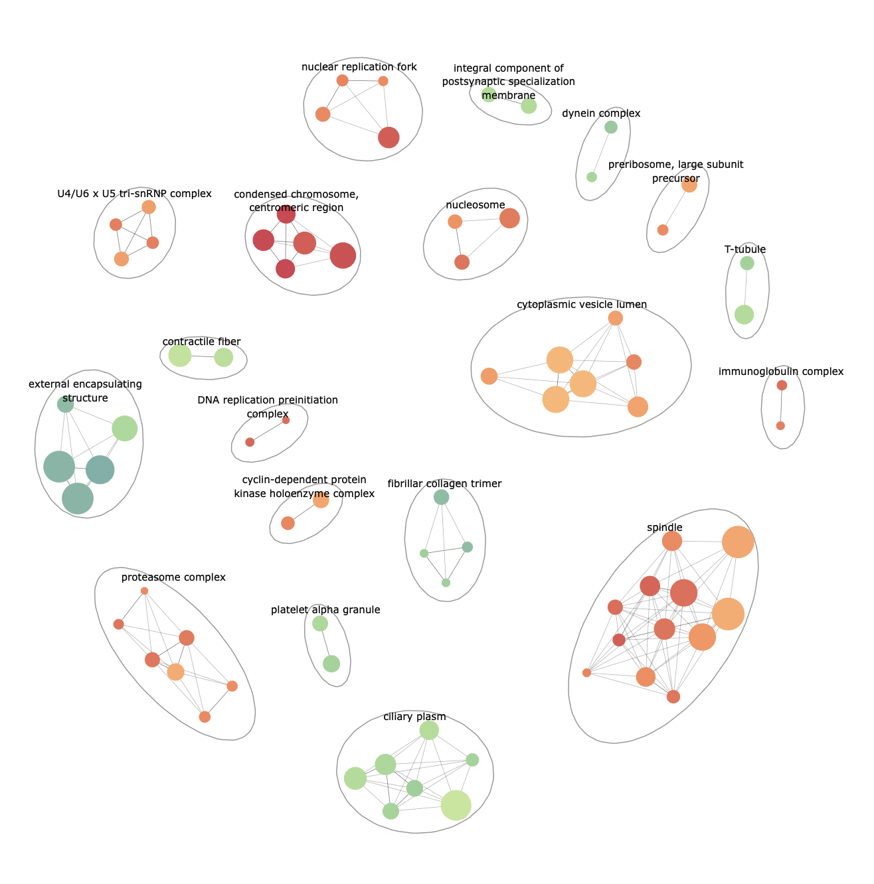

# pathExplore - an R package for high level GSEA exploration



## Installation

### Install latest stable version

```R
library(devtools)
install_github('ievaKer/pathExplore')
```

### Install latest beta version

```R
library(devtools)
install_github('ievaKer/pathExplore@development')
```

### Run an example

```R
library(pathExplore)
library(clusterProfiler)
library(org.Hs.eg.db)
library(DOSE)
data(geneList)

enrich <- gseGO(geneList, OrgDb = org.Hs.eg.db, ont = 'CC')
p <- enrichmentNetwork(enrich@result)

p
```

### Plotly integration

To create interactive plots, use plotly:

```R
library(plotly)

ggplotly(p, tooltip=c('ID', 'Cluster', 'Cluster size'))
```

You may find example plots in __results__ directory of this repository.

## Evaluation

- [x] Create multiple (10) datasets containing enrichment results from RNASEQ and EPIC experiments
- [x] Evaluate similarity calculation times (100-1000-50 pathways, calculate mean for all datasets)
  - [x] jaccard
  - [x] cosine
  - [x] correlation
- [ ] Evaluate clustering quality (all datasets with 500 pathways, calculate mean for all datasets)
  - [ ] what metrics to use?
  - [ ] markov (j-c-c)
  - [ ] hierarchical (j-c-c)
  - [ ] spectral (j-c-c)
- [ ] Evaluate program execution times (100-1000-50 pathways, calculate mean for all datasets)
  - [ ] markov (j-c-c)
  - [ ] hierarchical (j-c-c)
  - [ ] spectral (j-c-c)
- [ ] Choose one gsea dataset and compare its results with Cytoscape?
